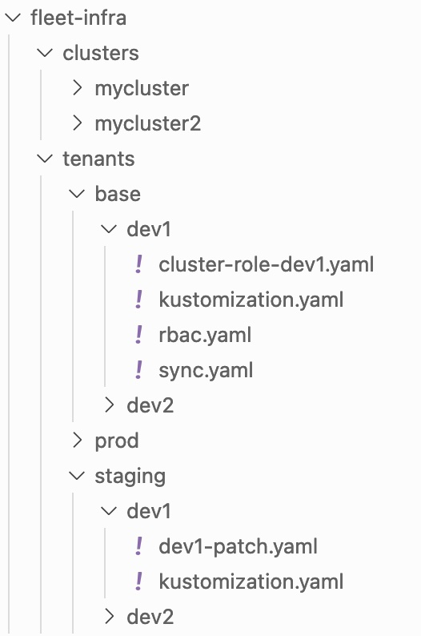
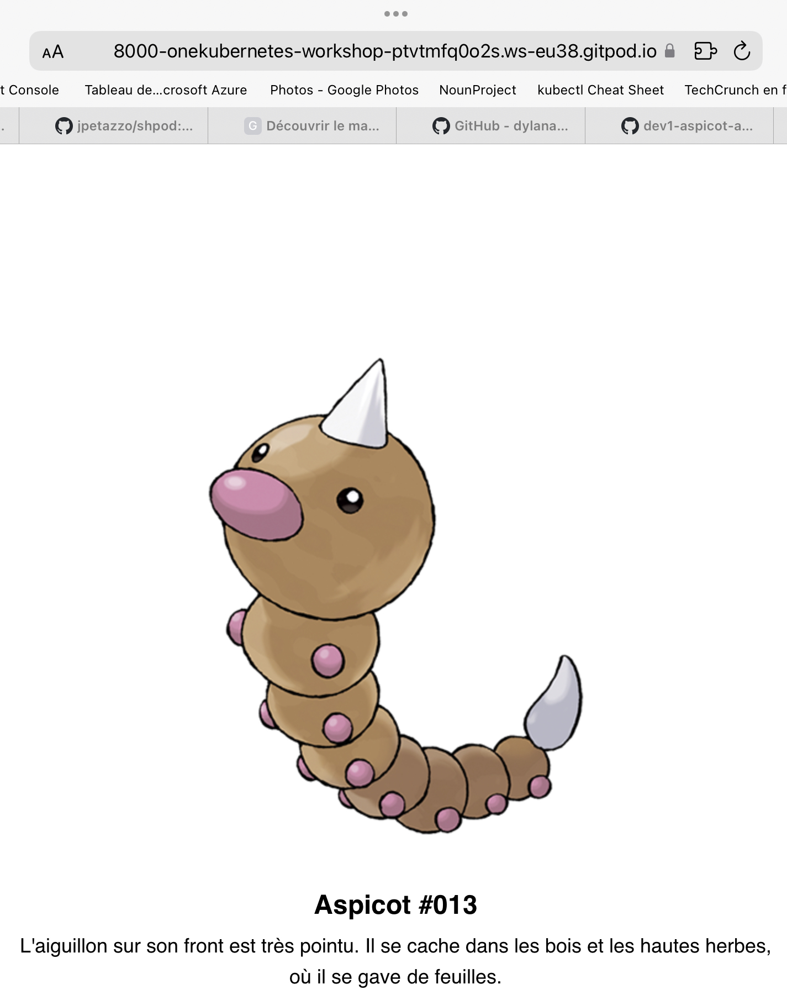

# Configuration Flux pour déploiement **dev1**

----

## Création du _tenant_ dédié à **dev1**

```bash
$ mkdir -p ./tenants/base/dev1
$ flux create tenant dev1            \
    --with-namespace=dev1-ns         \
    --cluster-role=dev1-full-access  \
    --export > ./tenants/base/dev1/rbac.yaml
```

----

### 📄 ./tenants/base/dev1/rbac.yaml

```yaml [1-7|9-16|18-36]
---
apiVersion: v1
kind: Namespace
metadata:
  labels:
    toolkit.fluxcd.io/tenant: dev1
  name: dev1-ns

---
apiVersion: v1
kind: ServiceAccount
metadata:
  labels:
    toolkit.fluxcd.io/tenant: dev1
  name: dev1
  namespace: dev1-ns

---
apiVersion: rbac.authorization.k8s.io/v1
kind: RoleBinding
metadata:
  labels:
    toolkit.fluxcd.io/tenant: dev1
  name: dev1-reconciler
  namespace: dev1-ns
roleRef:
  apiGroup: rbac.authorization.k8s.io
  kind: ClusterRole
  name: dev1-full-access
subjects:
- apiGroup: rbac.authorization.k8s.io
  kind: User
  name: gotk:dev1-ns:reconciler
- kind: ServiceAccount
  name: dev1
  namespace: dev1-ns
```

----

## Isolation du _namespace_ dédié à **dev1**

```bash
$ cat << EOF | tee ./tenants/base/dev1/cluster-role-dev1.yaml
---
apiVersion: rbac.authorization.k8s.io/v1
kind: ClusterRole
metadata:
  namespace: dev1-ns
  name: dev1-full-access
rules:
- apiGroups: ["", "extensions", "apps"]
  resources: ["deployments", "replicasets", "pods", "services", "ingresses"]
  verbs: ["get", "list", "watch", "create", "update", "patch", "delete"] # You can also use ["*"]
EOF
```

----

## Création de la source `Github` dédié à **dev1**

```bash [1-5|6-10|11-13]
$ flux create source git dev1-aspicot
    --namespace=dev1-ns
    --url=https://github.com/one-kubernetes/dev1-aspicot-app/
    --branch=main
    --export > ./tenants/base/dev1/sync.yaml
$ flux create kustomization dev1
    --namespace=dev1-ns
    --service-account=dev1
    --source=GitRepository/dev1-aspicot
    --path="./" --export >> ./tenants/base/dev1/sync.yaml
$ cd ./tenants/base/dev1/
$  kustomize create --autodetect
$ cd -
```

----

### 📄 ./tenants/base/dev1/sync.yaml

```yaml [1-11|13-26]
---
apiVersion: source.toolkit.fluxcd.io/v1beta1
kind: GitRepository
metadata:
  name: dev1-aspicot
  namespace: dev1-ns
spec:
  interval: 1m0s
  ref:
    branch: main
  url: https://github.com/one-kubernetes/dev1-aspicot-app/

---
apiVersion: kustomize.toolkit.fluxcd.io/v1beta2
kind: Kustomization
metadata:
  name: dev1
  namespace: dev1-ns
spec:
  interval: 1m0s
  path: ./
  prune: false
  serviceAccountName: dev1
  sourceRef:
    kind: GitRepository
    name: dev1-aspicot
```

----

### 📄 ./tenants/base/dev1/kustomization.yaml

```yaml
apiVersion: kustomize.config.k8s.io/v1beta1
kind: Kustomization
resources:
- cluster-role-dev1.yaml
- rbac.yaml
- sync.yaml

```

----

### Synchro avec le dépôt Github

Après git commit && git push, on obtient cette arborescence.



----

### Création de la kustomization dans le dépôt de dev


* `Flux` scrute le dépôt de **dev1**, mais il s'attend à y trouver un fichier `kustomization.yaml`
* dev1 doit donc y créer ce fichier

```bash
$ kustomize create --autodetect
```

----

### Ajout d'un patch spécifique à dev1 en staging


```bash [1|2-10|11-20]
$ mkdir -p ./tenants/staging/dev1
$ cat << EOF | tee ./tenants/staging/dev1/dev1-patch.yaml
apiVersion: kustomize.toolkit.fluxcd.io/v1beta1
kind: Kustomization
metadata:
  name: dev1
  namespace: dev1-ns
spec:
  path: ./
EOF
cat << EOF | tee ./tenants/staging/dev1/kustomization.yaml
apiVersion: kustomize.config.k8s.io/v1beta1
kind: Kustomization
resources:
  - ../../base/dev1
patches:
  - path: dev1-patch.yaml
    target:
      kind: Kustomization
EOF
```

----

### dev1-aspicot est déployé



----

### ⚠️ Limitations

* Pour chaque nouveau dépôt applicatif, **ops** doit ajouter une source `Flux`
* **dev1** est celui qui produit le `deployment.yaml`
    * et donc, **ops** a peu de latitude pour configurer des comportements différents entre `staging` et `prod`